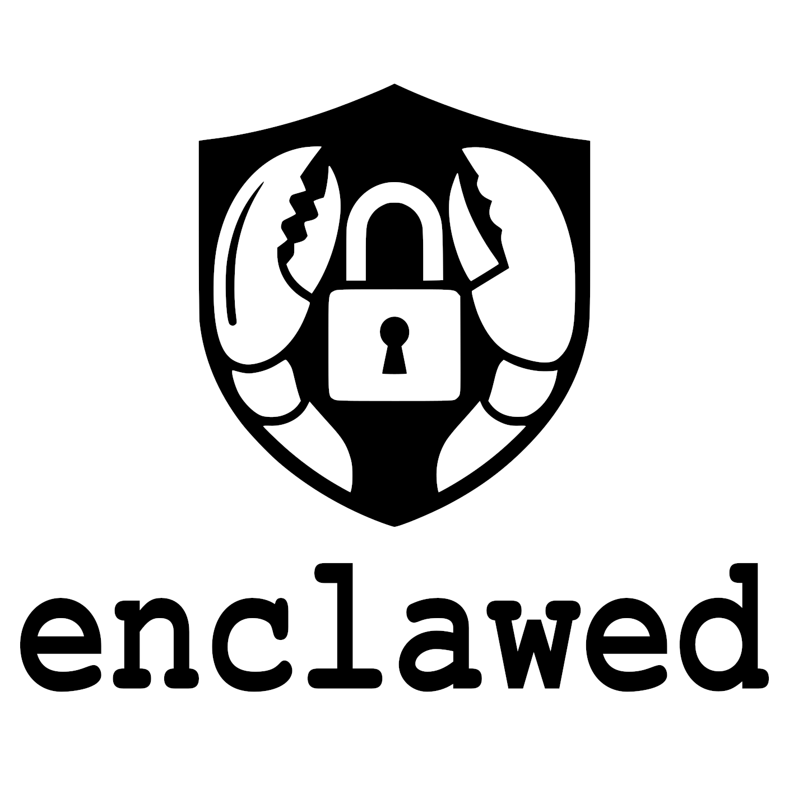

<p align="center">
  
</p>

# enclawed — Hardened single-user AI gateway for high-trust environments

A hard fork of [OpenClaw](https://github.com/openclaw/openclaw) intended to
run as a single-user AI assistant inside any environment that needs
attestable peer trust, deny-by-default external connectivity, signed-module
loading, and tamper-evident audit. Sector-neutral: works for **financial
services** (handling material-non-public data), **healthcare** (handling
PHI under HIPAA / GDPR Art. 9), **regulated R&D** (embargoed research,
trade-secret IP, ITAR/EAR-controlled materials), **defense contractors**
(CMMC, NIST 800-171), **government enclaves** (NIST 800-53 / FedRAMP /
DoD / DoE), and any other regulated-industry deployment.

> **enclawed is a hardening framework, not an accredited compliance
> certification.** A real audit, ATO, ISO 27001 certificate, SOC 2 report,
> HITRUST validation, or comparable attestation still requires accredited
> hardware, validated cryptographic modules, certified facilities (SCIF /
> physical-security plan / data-center audit), an evaluation by a
> qualified assessor, and management sign-off. Code alone cannot satisfy
> any of those. See [`enclawed/FORK.md`](enclawed/FORK.md) for the full
> deletion catalog, control-mapping (NIST 800-53 / ISO 27001 / SOC 2 /
> NIST CSF / GDPR / HIPAA), and the explicit list of work the deploying
> organization still owns.

## Quick start — see the framework defend itself in 9 scenes

A self-contained, hermetic, no-deps demo runs every security primitive
end-to-end against real adversarial inputs. It writes all artifacts to
an OS tmpdir that is deleted on exit, so it leaves no trace on your
system.

### Prerequisites

- **Node 22+** (uses only `node:test`, `node:crypto`, `node:fs/promises`,
  `node:os`, `node:path`). No `npm install` required.
- A terminal. Output uses ANSI colors by default; pass `--no-color` if
  your terminal does not render them.

### Run it

```bash
# from the repo root:
node enclawed/demo/demo.mjs

# or via the npm script (same thing, ~170 ms):
cd enclawed && npm run demo

# flags:
node enclawed/demo/demo.mjs --no-color   # plain ASCII output
node enclawed/demo/demo.mjs --quiet      # one verdict line per scene
```

Exit code is `0` if every scene passes, non-zero otherwise. The demo
uses an ephemeral trust root, an ephemeral audit log under `tmpdir()`,
and a stub `fetch` — nothing touches the network, your filesystem, or
any global state.

### What the demo shows

Each scene exercises the OSS canonical `.mjs` reference under
`enclawed/src/` and prints `✓` / `✗` marks for each assertion.

| # | Scene | What it proves |
| - | ----- | -------------- |
| 1 | **Classification + Bell-LaPadula** | Loads the `US_GOVERNMENT` scheme (UNCLASSIFIED → TOP_SECRET//SCI). Shows that a SECRET-cleared subject **may read** a SECRET object, **may not read up** to TOP_SECRET, and **may not write down** to PUBLIC. Confirms the lattice is asymmetric: `TOP_SECRET ▷ SECRET`. |
| 2 | **DLP scanner** | Feeds a payload containing an industry classification banner, an AWS access key, an OpenAI API key, a 16-digit PAN, and an email. `scan()` identifies every secret; `redact()` replaces each one with `[REDACTED]` before anything reaches the audit log. |
| 3 | **Egress allowlist** | Installs an allowlist of `127.0.0.1` + `localhost`. Shows that `127.0.0.1/api/health` passes through and returns 200, while `https://api.openai.com/v1/messages` throws `EgressDeniedError` and fires the `onDeny` audit hook. |
| 4 | **Ed25519 module signing** | Generates an ephemeral keypair, installs a trust root, signs a module manifest. Then attempts **three hostile variants**: a signed-but-tampered manifest (signature check fails), an unsigned manifest under the `enclaved` flavor (rejected), and the same unsigned manifest under the `open` flavor (allowed with a warning — the two flavors behave as documented). |
| 5 | **Hash-chained audit log** | Writes 4 audit records, calls `verifyChain()` → `ok: true`. Then silently rewrites the middle record's payload in-place (simulating an insider edit), re-verifies, and shows the chain reports `TAMPER DETECTED at record #1 (recordHash mismatch)`. |
| 6 | **Prompt-injection sanitizer** | Submits a payload containing a unicode bidi override (`\u202E`), a fenced system-role boundary, and a classic `Ignore previous instructions` imperative. `detectInjection()` flags all three indicators; `sanitizeForPrompt()` strips the bidi, neutralizes the fence, and the output is safe to embed in a downstream prompt. |
| 7 | **Human-in-the-loop approval** | Starts an `AgentSession` that requires approvals for `network.outbound`. The agent proposes `POST https://leak-site.example/upload`. The operator denies from the approval queue. The agent-side `await proposeAction(...)` rejects with `ApprovalDeniedError("network.outbound")`. Demonstrates cooperative cancellation without forced thread termination. |
| 8 | **Transaction buffer + rollback** | Creates a `TransactionBuffer` sized to 1 % of system RAM. Records two compensable actions (a filesystem write, a DB insert). Shows live side-effect state. Then calls `rollback(2)` — each inverse fires in LIFO order, and the side-effect state returns to pre-transaction. |
| 9 | **AES-256-GCM at-rest envelope** | Encrypts a CONFIDENTIAL payload with a scrypt-derived key and AAD-binds it to `analyst-7`. Round-trips back identically. A decryption attempt with the wrong passphrase fails the GCM authentication tag (rejected, not silently corrupted). |

### Expected output

You should see nine bordered scene headers, each followed by `✓` marks
for every assertion, and a closing line:

```
all 9 scenes passed.
207 unit + adversarial pen-tests cover these primitives — see `npm test`.
```

If any assertion fails, the demo prints a `✗` with the exact mismatch
and exits non-zero. This is the same harness we use on CI
(`.github/workflows/enclawed-security.yml`) so a green demo is a
signal that the deployed framework is intact on your machine.

## Two flavors

`enclawed` ships in two flavors selected at boot via `ENCLAWED_FLAVOR`:

| Flavor | Default | Posture |
| ------ | ------- | ------- |
| `open` | yes | OpenClaw-compatible. Allowlists not enforced; module signatures warn-only; FIPS not asserted by default. The framework still runs (audit log, DLP redaction, classification-label types, module-loader trust-root, MCP attestation verifier). Use this for development and any non-regulated deployment. |
| `enclaved` | opt-in | High-trust deployment (regulated industry, classified enclave). Strict deny-by-default channel/provider/tool/host allowlists, FIPS asserted at boot, every loaded module MUST present a manifest signed by a trust-root signer approved for its declared clearance tier, MCP connections refused unless the remote server attests to at least the caller's required tier. |

## What stays vs. what was removed

**Removed** (78 module directories from upstream — not loadable in
high-trust deployments anyway):

- **External chat channels** (~25): WhatsApp, Telegram, Slack, Discord,
  Signal, iMessage, Matrix, Microsoft Teams, IRC, etc.
- **External LLM providers** (~45): OpenAI, Anthropic, Google, Mistral,
  Groq, AWS Bedrock, Azure OpenAI, OpenRouter, Fireworks, etc.
- **External search / browser / webhooks** (~8): Brave, DuckDuckGo, Exa,
  Firecrawl, SearXNG, Tavily, Browser, Webhooks.

**Kept** — all local or local-capable:

- Local LLM runtimes: Ollama, vLLM, LM Studio, SGLang, NVIDIA NIM, llm-task.
- Local image / media: ComfyUI, image/video/media generation cores.
- Local memory: memory-core, memory-lancedb, memory-wiki, active-memory.
- Local channels and shells: openshell, qa-channel, qa-lab, qa-matrix,
  phone-control (LAN), webchat (loopback only).
- All core gateway, plugin SDK, and runtime infrastructure.

**Added** — `modules/mcp-attested/`: reference Model Context Protocol client
that only connects to MCP servers presenting a signed clearance attestation
from a trust-root signer. Works with any sector's trust hierarchy.

## What the framework adds (always on)

- **Bell-LaPadula classification labels** with a six-tier numeric ladder
  exposed under both **generic industry names** (`PUBLIC` < `INTERNAL` <
  `CONFIDENTIAL` < `RESTRICTED` < `RESTRICTED-PLUS` < `SCI`) and
  **US-government aliases** (`UNCLASSIFIED` < `CUI` < `CONFIDENTIAL` <
  `SECRET` < `TOP_SECRET` < `TOP_SECRET//SCI`). Plus templates for DOE Q
  and L clearance for organizations operating against US-gov guidance.
  (`src/enclawed/classification.ts`)
- **Deny-by-default policy** for channels, providers, tools, and outbound
  hosts. Configurable; ships with `defaultEnclavedPolicy()` and
  `defaultOpenPolicy()`. (`src/enclawed/policy.ts`)
- **Egress allowlist** wrapping `globalThis.fetch` so any module attempting
  to reach an unlisted host is denied and audited. (`src/enclawed/egress-guard.ts`)
- **Hash-chained append-only audit log** (SHA-256, JSONL, independently
  verifiable). (`src/enclawed/audit-log.ts`)
- **DLP scanner** — sensitive-data markings (industry banners +
  US-government markings), cloud / vendor secret formats (AWS / GCP /
  Azure / GitHub / GitLab / OpenAI / Anthropic / Slack / Stripe / JWTs /
  PEM private keys), and PII (international email, E.164 phone, credit-card
  PAN, IBAN, US SSN). Every log line redacted before reaching console / file.
  (`src/enclawed/dlp-scanner.ts`)
- **AES-256-GCM at-rest envelope** with FIPS-mode assertion gate.
  (`src/enclawed/crypto-fips.ts`)
- **Secret zeroizer** for in-process Buffer / Uint8Array material.
  (`src/enclawed/zeroize.ts`)
- **Ed25519 module-signing** with `enclawed.module.json` manifest schema,
  trust-root with per-signer clearance approval, boot-time pre-verification
  of every module on disk. (`src/enclawed/module-signing.ts`,
  `module-loader.ts`, `trust-root.ts`)
- **Flavor system** — `getFlavor()` reads `ENCLAWED_FLAVOR`, defaults to
  `"open"`. (`src/enclawed/flavor.ts`)

## Documentation

- [`enclawed/FORK.md`](enclawed/FORK.md) — full fork charter.
- [`enclawed/README.md`](enclawed/README.md) — framework module reference.
- [`enclawed/config/classified-profile.example.json`](enclawed/config/classified-profile.example.json)
  — reference deployment profile for the enclaved flavor.

## License

MIT (inherited from upstream OpenClaw). See [`LICENSE`](LICENSE).
